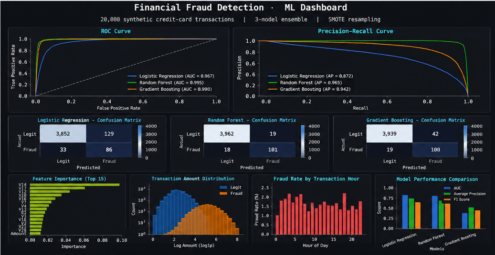

# Credit Card Fraud Detection using Machine Learning

A machine learning-based financial fraud detection system developed using Python and multiple classification algorithms to identify fraudulent transactions accurately.

## Features
- Fraud transaction detection
- Machine Learning classification models
- SMOTE for handling imbalanced data
- ROC-AUC and F1 score evaluation
- Data preprocessing and feature engineering
- Fraud analysis dashboard generation

## Machine Learning Algorithms Used
- Logistic Regression
- Random Forest
- Gradient Boosting

## Technologies Used
- Python
- Scikit-learn
- Pandas
- NumPy
- Matplotlib
- Imbalanced-learn (SMOTE)

## Screenshots

### Dashboard

### Results

## Output

The system successfully detects fraudulent credit card transactions using Machine Learning models such as Logistic Regression, Random Forest, and Gradient Boosting. The project includes data preprocessing, SMOTE oversampling, feature engineering, performance evaluation, and visualization techniques to improve fraud detection accuracy.

### Key Functionalities
- Fraud detection using classification algorithms
- ROC Curve and Precision-Recall visualization
- Confusion Matrix analysis
- Feature importance analysis
- Fraud rate visualization by transaction hour
- Dashboard generation using Matplotlib

### Result
The Random Forest model achieved the best fraud detection performance with high ROC-AUC and F1-score values.

## Author
Shashanth Ponugoti
